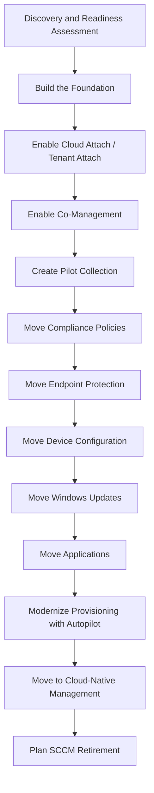
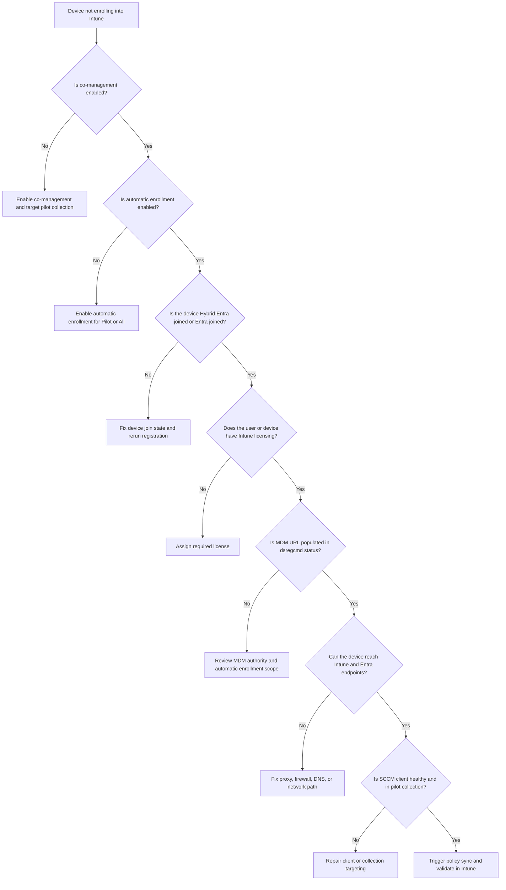

# SCCM Configuration Manager to Intune Migration Guide

*A Playbook for Low-Risk Modern Management Adoption*

This guide combines Microsoft's recommended approach with migration roadmaps I have used in workshops and customer engagements.

## Key Principle

> **Do not treat SCCM to Intune as a rip-and-replace project.**

Treat it as a **co-management journey** where workloads are gradually transitioned from Configuration Manager to Intune while maintaining rollback capability.

---

## Migration Flow



---

# Phase 1: Discovery and Readiness Assessment

## 1. Current State Inventory

Document the following areas before making workload changes.

### Devices

- Windows 10/11 count
- Hybrid joined devices
- Entra joined devices
- Remote devices
- VPN dependency

### Configuration Manager

- Site hierarchy
- Cloud Management Gateway, also known as CMG, deployment
- Current Configuration Manager version
- Distribution points
- Cloud attach status

### Management Workloads

- Compliance
- Updates
- Endpoint Protection
- Device Configuration
- Application Deployment
- Office Updates
- OS Deployment

### Identity

- Entra Connect
- Hybrid Join
- Conditional Access
- MFA

### Provisioning

- MDT
- SCCM task sequences
- PXE imaging
- Existing Autopilot configuration

These are commonly identified as migration dependencies during SCCM-to-Intune assessments.

---

# Phase 2: Build the Foundation

Before touching workloads, validate the core prerequisites.

## Licensing

Validate that the organization has the appropriate licensing for:

- Intune Plan 1
- Microsoft 365 E3/E5
- EMS E3/E5

Co-management requires:

- Configuration Manager
- Intune licensing

> No separate co-management SKU exists.

---

## Entra Join Readiness

Devices should be either:

- Hybrid Entra joined

or

- Entra joined

Check device join status with:

```powershell
dsregcmd /status
```

Look for:

```text
AzureAdJoined : YES
```

or:

```text
DomainJoined : YES
AzureAdJoined : YES
```

Hybrid Join is typically the fastest migration path for existing domain-joined Configuration Manager environments.

---

## Enable Cloud Attach / Tenant Attach

Tenant Attach is a recommended foundational step.

### Benefits

- SCCM devices become visible in Intune
- Remote actions are available from the Intune admin center
- Resource Explorer visibility improves
- Administrators gain more unified endpoint visibility

Tenant Attach is often enabled before workload transition.

---

# Phase 3: Enable Co-Management

In the Configuration Manager console, go to:

```text
Administration
└── Cloud Services
    └── Cloud Attach
```

Run:

```text
Configure Cloud Attach
```

Configure automatic enrollment.

## Automatic Enrollment Options

- Pilot
- All

Recommended starting point:

```text
Pilot
```

Avoid starting with:

```text
All Devices
```

Microsoft and customer workshop guidance consistently recommend phased deployment.

---

# Phase 4: Pilot Group Creation

Create a pilot collection.

## Recommended Pilot Size

```text
25 to 50 devices
```

## Recommended Pilot Characteristics

- IT staff
- Technically savvy users
- Variety of hardware models
- Remote users
- Office users
- Mix of laptop and desktop devices
- Representative business applications installed

## Avoid

- Executives
- Shared kiosk devices
- Mission-critical devices

---

# Phase 5: Workload Migration Order

## Recommended Workload Sequence

---

## Wave 1: Compliance Policies

Move this workload first.

### Why This Moves Early

- Lower risk than application or provisioning changes
- Supports Conditional Access readiness
- Helps validate Intune reporting
- Provides early cloud-management value

### Examples

- BitLocker
- Secure Boot
- Antivirus
- OS version requirements
- Device health settings
- Defender requirements

### Workload Slider

```text
Compliance Policies
-> Pilot Intune
```

### Validate

- Devices report compliant
- Compliance policy is assigned to the correct pilot group
- Conditional Access strategy is validated
- Compliance states appear correctly in Intune reporting

---

## Wave 2: Endpoint Protection

Move security-focused settings after compliance is validated.

### Move

- Defender Antivirus
- Firewall
- Attack Surface Reduction rules
- Security baselines
- Endpoint protection settings

### Validate

- Security baselines apply successfully
- Microsoft Defender for Endpoint integration is working
- Device security posture is visible
- Security settings do not conflict with legacy GPO or SCCM baselines

Endpoint Protection is often one of the safer workloads to migrate early, provided policy conflicts are reviewed first.

---

## Wave 3: Device Configuration

Move device configuration after compliance and endpoint security are stable.

### Move

- CSP settings
- Administrative Templates
- Settings Catalog policies

### Migration Approach

```text
GPO -> Intune
```

### Important Guidance

Do not copy every GPO directly into Intune.

Instead:

- Review each GPO
- Identify what is still required
- Remove obsolete settings
- Redesign where Intune-native controls are better
- Avoid duplicating legacy configuration problems in the cloud

Several workshop plans explicitly call out GPO migration as an area where some settings can be ported, while others should be redesigned.

---

## Wave 4: Windows Updates

Move Windows Update management after policy and security readiness have been validated.

### Move To

- Windows Update for Business
- Update Rings
- Feature Updates
- Quality Updates
- Autopatch, if applicable

### Workload

```text
Windows Update Policies
```

### Validate

- Update source changed
- No remaining WSUS dependency
- No SCCM software update conflict
- Update Ring policy is applied
- Feature Update profile is applied
- Update compliance reporting is visible

### Common Issue

Devices may continue obtaining updates from WSUS because of legacy Group Policy settings.

### Troubleshooting Check

```powershell
$data = (New-Object -ComObject "Microsoft.Update.ServiceManager").Services |
    Where-Object { $_.IsDefaultAUService -eq $true }

Write-Host $data.Name
```

Expected result:

```text
Microsoft Update
```

If the result shows:

```text
Windows Server Update Service
```

then the device may still be receiving update direction from WSUS or legacy policy.

---

## Wave 5: Applications

Application migration is usually the most complex workload.

### Inventory

- MSI applications
- EXE installers
- PowerShell-based installs
- Legacy applications
- Application dependencies
- Target collections
- Detection methods
- Required vs available assignments

### Convert To

- Win32 Apps
- Microsoft Store Apps
- Line-of-business apps

### Review

- Detection rules
- Dependencies
- Supersedence
- Install commands
- Uninstall commands
- Return codes
- User vs device assignment
- Restart behavior

Many customers underestimate application migration effort. Start with a small set of low-risk applications before moving business-critical apps.

---

# Phase 6: Provisioning Modernization

## Current Model

Most SCCM customers use some combination of:

```text
MDT
PXE
Task Sequences
```

## Target Model

```text
Windows Autopilot
Intune
Entra ID
```

## Common Transition

```text
PXE -> Autopilot
```

## Questions to Answer

- Is pre-provisioning needed?
- Is user-driven deployment acceptable?
- Are thick images still required?
- Are there driver dependencies?
- Are there network dependencies during provisioning?
- Are there line-of-business applications required during enrollment?
- Are task sequences still needed for any edge cases?

Autopilot is often the largest organizational change because it changes provisioning workflows, not just technology.

---

# Phase 7: Move to Cloud-Native

After workloads are migrated and validated, start shifting new device provisioning to a cloud-native model.

## New Devices

Deploy with:

```text
Autopilot
+
Intune
+
Entra Join
```

Avoid using:

```text
Hybrid Join
```

for new deployments whenever business requirements allow.

---

## Validation Checklist

Confirm the following before expanding beyond the pilot:

- [ ] Intune enrollment is successful
- [ ] Devices show as co-managed where expected
- [ ] Compliance policy is applied
- [ ] Security baseline is applied
- [ ] Application deployment is working
- [ ] Windows Update policies are applied
- [ ] Conditional Access readiness is validated
- [ ] Endpoint Analytics reporting is available
- [ ] Autopilot deployment is successful
- [ ] Remote users are supported
- [ ] Help desk process is documented
- [ ] Rollback path is understood

---

# Phase 8: SCCM Retirement

Do not retire SCCM until the organization has validated full cloud-management readiness.

## Do Not Retire SCCM Until

- All targeted workloads are migrated
- All device collections are reviewed
- All packages and applications are reviewed
- CMG is no longer required
- Distribution points are no longer required
- Task sequences are retired or replaced
- WSUS dependencies are removed
- Reporting requirements are moved or replaced
- Operational support model is updated

## Retirement Tasks

```text
Remove SCCM deployments
Remove WSUS dependencies
Remove distribution points
Remove site systems
Remove SCCM client
```

Example client uninstall command:

```cmd
ccmsetup.exe /uninstall
```

Only proceed after validation of full cloud management.

---

# Top 10 Migration Pitfalls

| Pitfall | Mitigation |
|---|---|
| Migrating everything at once | Use pilot collections |
| Poor application inventory | Assess and clean applications first |
| WSUS GPO conflicts | Remove legacy update policies |
| Duplicate Entra objects | Clean stale devices |
| No CMG for remote devices | Deploy CMG before migration if SCCM policy is still needed |
| No rollback strategy | Keep SCCM authority during pilot |
| Large task sequence dependence | Plan Autopilot redesign |
| Ignoring Delivery Optimization | Validate content distribution strategy |
| Moving applications too early | Start with compliance and security |
| Treating GPO migration as copy and paste | Redesign using Intune-native controls |

---

# Troubleshooting Flow: Device Not Enrolling into Intune

Use this when devices remain Configuration Manager only or fail to appear in Intune.



## Useful Commands

Check device join state:

```powershell
dsregcmd /status
```

Force Group Policy update:

```cmd
gpupdate /force
```

Trigger device registration:

```cmd
dsregcmd /join
```

Uninstall Configuration Manager client, only when ready:

```cmd
ccmsetup.exe /uninstall
```

---

# Recommended 30/60/90 Day Plan

## Days 1 to 30

- Assessment
- Licensing validation
- Tenant Attach
- Co-management setup
- Pilot collection
- Initial readiness and risk log

## Days 31 to 60

- Compliance workload
- Endpoint Protection
- Device Configuration workload
- Pilot validation
- Conditional Access readiness validation

## Days 61 to 90

- Windows Updates
